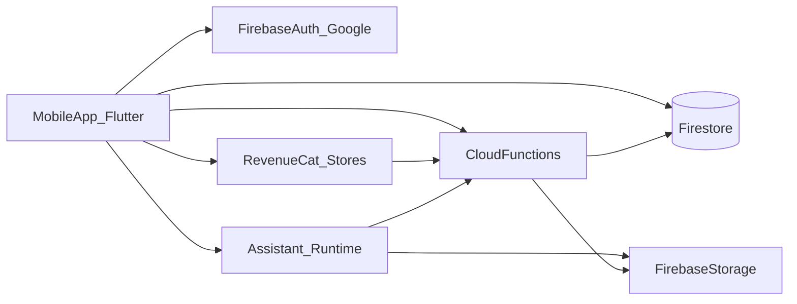

# Producto y backlog — App familia + asistente IA

**Versión del documento:** 1.3  
**Última actualización:** 2026-04-19  
**Propósito:** Marco de referencia para historias de usuario, refinamiento y trazabilidad de alcance. No sustituye diseño visual final ni contratos de API versionados.

**Cambios v1.1:** Se cierran **ADR-001** (stack **Flutter**) y **ADR-002** (cobro **por familia**).  
**Cambios v1.2:** Se cierran **ADR-003** (**RevenueCat** para billing móvil) y **ADR-004** (**backend completo en Firebase**).  
**Cambios v1.3:** Se cierran **ADR-005** (**Gemini** como LLM por defecto, **proveedor configurable**) y **ADR-006** (**modo offline con caché**).

---

## Tabla de contenidos

1. [Visión y alcance](#1-visión-y-alcance)
2. [Glosario](#2-glosario)
3. [Decisiones de arquitectura y producto (ADR)](#3-decisiones-de-arquitectura-y-producto-adr)
4. [Requisitos no funcionales](#4-requisitos-no-funcionales)
5. [Arquitectura lógica](#5-arquitectura-lógica)
6. [Modelo de dominio transversal](#6-modelo-de-dominio-transversal)
7. [Módulos funcionales (profundización v1)](#7-módulos-funcionales-profundización-v1)
8. [Asistente: contrato de herramientas, confirmación y auditoría](#8-asistente-contrato-de-herramientas-confirmación-y-auditoría)
9. [Suscripción, entitlements y billing](#9-suscripción-entitlements-y-billing)
10. [Diseño UX/UI: DS tipo Material 3 / Sigma DS3 + cozy](#10-diseño-uxui-ds-tipo-material-3--sigma-ds3--cozy)
11. [Backlog por épicas](#11-backlog-por-épicas)
12. [Riesgos y mitigaciones](#12-riesgos-y-mitigaciones)
13. [Definición de terminado (DoD) transversal](#13-definición-de-terminado-dod-transversal)
14. [Historia vertical sugerida (primer sprint útil)](#14-historia-vertical-sugerida-primer-sprint-útil)

---

## 1. Visión y alcance

### 1.1 Visión

Aplicación **nativa iOS y Android** con cliente en **Flutter** para **hogares / familias**: los miembros comparten gastos, stock del hogar, recetas, notas y enlaces útiles. Un **asistente con IA** es parte central del producto: conversa en texto y audio, **lee** el estado del hogar y **ejecuta acciones** controladas (crear o actualizar datos) con las mismas reglas que la interfaz manual.

### 1.2 Alcance funcional v1

- **Login** con **Google** (otros proveedores en roadmap explícito, sin comprometer el modelo de identidad).
- **Familia** como espacio de datos compartido; **todos los miembros** tienen las mismas capacidades funcionales en v1.
- **Invitaciones** para sumar miembros a la familia.
- **Monetización:** mecanismo de **suscripción + entitlements** presente desde v1; la unidad de cobro es la **familia** (ADR-002). En la primera etapa comercial **todas las funciones pueden permanecer habilitadas** mediante configuración de entitlements (feature flags / plan “full”).
- **Solapas / módulos:** Resumen (home), Gastos, Stock, Recetas, Notas y enlaces, Asistente.
- **Multi-moneda** en gastos; **moneda por defecto: ARS** a nivel familia (configurable al crear el hogar).
- **Backend:** plataforma **Firebase** (Auth, Firestore, Cloud Functions, Storage, reglas de seguridad, jobs programados donde aplique) — ver **ADR-004**.
- **Pagos móviles:** **RevenueCat** delante de App Store / Google Play — ver **ADR-003**.
- **IA generativa:** **Google Gemini** como modelo por defecto en servidor; capa de proveedor **configurable** (otro modelo o endpoint sin redeploy masivo) — ver **ADR-005**.
- **Conectividad:** **caché offline** de datos en cliente (Firestore persistence) con cola de escrituras y UX clara sin red — ver **ADR-006**.

### 1.3 Fuera de alcance v1 (explícito)

- Roles diferenciados (solo lectura, menor de edad, aprobación de gastos): **no** en v1 salvo decisión posterior documentada en ADR.
- Suscripción web fuera de tiendas (opcional más adelante); v1 asume **facturación vía App Store / Google Play** para móvil.
- Conteo real de unidades de stock (inventario numérico).

### 1.4 Interpretación de “MCP”

En cliente móvil no es obligatorio exponer [Model Context Protocol](https://modelcontextprotocol.io/) al dispositivo. Lo recomendable es:

- **Runtime de asistente en servidor** (o funciones gestionadas) con **herramientas** = endpoints internos o conectores.
- El protocolo MCP puede usarse **solo en servidor** como capa de integración con proveedores o sistemas internos si aporta mantenibilidad.

La app consume **Firebase** (Firestore + **Cloud Functions** como capa de API segura) + **function calling** del asistente (esquema de herramientas versionado). Los secretos de proveedores de IA viven solo en Functions / Secret Manager.

---

## 2. Glosario

| Término                | Definición                                                                                                                                                                            |
| ---------------------- | ------------------------------------------------------------------------------------------------------------------------------------------------------------------------------------- |
| **Usuario**            | Persona autenticada (cuenta Google en v1).                                                                                                                                            |
| **Familia / hogar**    | Contenedor lógico de datos y configuración compartida (`family_id`).                                                                                                                  |
| **Miembro**            | Relación usuario ↔ familia con estado (activo, invitado, etc.).                                                                                                                       |
| **Familia activa**     | Familia seleccionada en la sesión del cliente (v1: puede asumirse una sola familia por usuario; si se permite más de una en el futuro, esta noción es obligatoria).                   |
| **Entitlement**        | Capacidad comercial/técnica (ej. `assistant_voice`, `expense_receipt_import`) habilitada según plan o flags.                                                                          |
| **Suscripción**        | Derecho de pago activo reconocido por las tiendas (vía RevenueCat) y reflejado en **Firestore**; en v1 se factura **por familia** (un entitlement compartido por todos los miembros). |
| **Gasto**              | Registro de egreso con moneda, categoría, método de pago y reglas de efectivización.                                                                                                  |
| **Efectivización**     | Momento en que un gasto impacta el “saldo real” o totales del mes según reglas (especialmente tarjeta de crédito).                                                                    |
| **Herramienta (tool)** | Acción estructurada invocable por el modelo y ejecutada en **Cloud Functions** (o lógica confiable server-side) con validación y permisos.                                            |

---

## 3. Decisiones de arquitectura y producto (ADR)

Registrar la opción elegida al cerrar cada decisión. Mientras esté abierta, el backlog debe contemplar **spikes** de evaluación.

| ID      | Decisión                      | Opciones                                         | Estado                                           | Notas                                                                                                                                                                                                                                                                                                                                                                                                                                                                                                                                     |
| ------- | ----------------------------- | ------------------------------------------------ | ------------------------------------------------ | ----------------------------------------------------------------------------------------------------------------------------------------------------------------------------------------------------------------------------------------------------------------------------------------------------------------------------------------------------------------------------------------------------------------------------------------------------------------------------------------------------------------------------------------- |
| ADR-001 | Stack móvil                   | Flutter / React Native                           | **Aceptado: Flutter**                            | UI/animaciones consistentes entre plataformas; Material 3 disponible vía theming; equipo puede apoyarse en ecosistema Dart/plugins.                                                                                                                                                                                                                                                                                                                                                                                                       |
| ADR-002 | Unidad de cobro               | Por **familia** / por usuario                    | **Aceptado: por familia**                        | Un solo estado de pago por hogar; todos los miembros comparten entitlements; “asientos” u otro modelo por miembro queda como evolución comercial opcional.                                                                                                                                                                                                                                                                                                                                                                                |
| ADR-003 | Proveedor billing móvil       | StoreKit + Play Billing directo / **RevenueCat** | **Aceptado: RevenueCat**                         | SDK en Flutter; productos y ofertas en App Store Connect / Play Console; webhooks a Cloud Functions para sincronizar estado de suscripción por familia; reporting y experimentación en dashboard RC.                                                                                                                                                                                                                                                                                                                                      |
| ADR-004 | Backend                       | BaaS / mixto / **Firebase end-to-end**           | **Aceptado: Firebase (stack completo)**          | Auth (Google), Firestore (datos + reglas), Cloud Functions (HTTPS / Callable / triggers / webhooks RevenueCat), Storage (adjuntos, audio), Scheduler o Functions programadas (gastos recurrentes). IA y herramientas del asistente se ejecutan en Functions con credenciales aisladas.                                                                                                                                                                                                                                                    |
| ADR-005 | Proveedor LLM / transcripción | OpenAI / Google / Anthropic / mixto              | **Aceptado: Gemini por defecto + configuración** | **LLM principal:** API **Gemini** (p. ej. Gemini API o Vertex AI según despliegue). **Configurabilidad:** en Cloud Functions, capa tipo *provider* + parámetros en **Secret Manager** / variables de entorno / **Remote Config** (modelo, temperatura, límites) para poder cambiar de proveedor o variante sin acoplar el resto del dominio. **Audio a texto:** pipeline configurable (p. ej. Gemini multimodal, Cloud Speech-to-Text u otro) con la misma idea de abstracción. Políticas de retención y región documentadas por entorno. |
| ADR-006 | Modo offline                  | Online-only / **caché + cola**                   | **Aceptado: offline-cache**                      | **Firestore:** persistencia local habilitada en Flutter; lectura con datos cacheados sin red. **Escrituras:** encoladas y sincronizadas al volver conectividad; indicadores “pendiente de sincronizar” y manejo básico de conflictos (último escritor gana o resolución explícita en casos críticos). **Requiere red obligatoria:** asistente conversacional, llamadas a Functions que no tengan sustituto local, compras in-app, subida de archivos a Storage, pipelines IA de importación.                                              |

---

## 4. Requisitos no funcionales

### 4.1 Seguridad

- Aislamiento estricto por `family_id` en todas las consultas y mutaciones.
- **Firestore:** reglas de seguridad que obliguen pertenencia a la familia en paths (`families/{familyId}/...`) y validen campos mínimos; operaciones sensibles o transversales (webhooks, IA, agregados) preferentemente vía **Cloud Functions** con privilegio administrativo.
- **Firebase Auth:** sesión del usuario; tokens con rotación gestionada por el SDK; no exponer claves de servicio en el cliente.
- Secretos de API (LLM, RevenueCat server-side si aplica) solo en **Secret Manager** / config de Functions, nunca en la app.
- Validación server-side (Functions) de toda herramienta del asistente (nunca confiar solo en reglas + cliente).

### 4.2 Privacidad y datos sensibles

- Recibos, facturas y **audio** pueden contener PII: política de **retención** (TTL de archivos en object storage, opción “borrar conversación”).
- Transparencia en settings: qué se envía al proveedor de IA.
- Cumplimiento con políticas de tiendas y ley aplicable (Argentina + tiendas globales).

### 4.3 Observabilidad

- Métricas de producto (embudo onboarding, uso por módulo, errores de billing).
- Logs estructurados sin volcar contenido de recibos ni texto libre completo del usuario en trazas de bajo nivel (enmascarar o hashear identificadores sensibles).

### 4.4 Rendimiento y costos

- Rate limits por usuario y por familia en endpoints de IA y subida de archivos.
- Tamaño máximo de adjuntos y de audio configurable.

### 4.5 Accesibilidad e i18n

- Contraste AA mínimo en temas claro/oscuro; soporte de **tamaño de texto dinámico** del SO.
- **es-AR** como idioma principal de UI y categorías precargadas; preparar strings externalizados para futuras locales.

### 4.6 Confiabilidad de datos

- Idempotencia en creaciones vía asistente cuando sea posible (`client_request_id`).
- Auditoría de mutaciones disparadas por IA (quién, cuándo, payload resumido).

### 4.7 Modo offline y caché (ADR-006)

- **Persistencia Firestore** en el cliente Flutter: datos de dominio (gastos, stock, recetas, notas, etc.) disponibles **offline** tras haber sido sincronizados al menos una vez.
- **Escrituras offline:** el SDK encola; la UI muestra estado *pending* / error de sync; reintentos automáticos al recuperar red.
- **Alcance:** no es “offline-first completo” para todos los flujos; las funciones que dependen de servidor (listado en **ADR-006**) muestran pantalla o banner “Sin conexión” con acciones diferidas cuando aplique.
- **Conflictos:** política v1 explícita — preferir **última escritura gana** en campos simples; para contención fuerte (p. ej. mismo documento) documentar fallback (merge por campo o aviso al usuario).

### 4.8 IA: Gemini y configurabilidad (ADR-005)

- Las **Cloud Functions** del asistente y de importación (ticket, recetas) invocan el **SDK/API de Gemini** por defecto.
- **Configuración externa:** nombre o ID de modelo, región/proyecto Vertex si aplica, top_p / temperatura acotados, y límites de tokens en configuración desplegable (no hardcodear en lógica de negocio).
- **Cambio de proveedor:** contrato interno único (`generateCompletion`, `transcribeAudio`, etc.) permite sustituir implementación (otro LLM) manteniendo las mismas herramientas y validaciones.
- **Costos y cuotas:** límites por familia/usuario en Functions; degradación elegante si se excede cuota.

---

## 5. Arquitectura lógica

**Flujo resumido:** el cliente **Flutter** usa **Firebase Auth** (Google), lee/escribe **Firestore** según reglas (con **persistencia local** para modo offline-cache), y llama **Callable/HTTPS Functions** para lógica privilegiada, webhooks (**RevenueCat** → Functions) y **asistente con herramientas** (LLM **Gemini** en servidor, capa configurable). **RevenueCat** habla con las tiendas; los eventos consolidan el estado de suscripción en Firestore. Adjuntos y audio en **Cloud Storage**.

---

## 6. Modelo de dominio transversal

### 6.1 Entidades base

- **User:** id, email, nombre visible, avatar, timestamps.
- **Family:** id, nombre, moneda_base (default ARS), configuración (ej. qué estados de stock cuentan como “falta comprar”), límites opcionales.
- **Membership:** user_id, family_id, rol simplificado v1 = `member`, estado `active` | `invited` | `removed`.
- **Invitation:** token o código, family_id, invitador, expiración, estado `pending` | `accepted` | `expired` | `revoked`.

### 6.2 Trazabilidad

- Campos recomendados en entidades de negocio: `created_by`, `updated_by`, `created_at`, `updated_at`.

---

## 7. Módulos funcionales (profundización v1)

### 7.1 Onboarding, familias e invitaciones

**Objetivo:** un usuario autenticado puede crear una familia o unirse vía invitación.

**Flujos:**

1. **Crear familia:** nombre + moneda base → familia creada → usuario es miembro `active`.
2. **Invitar:** generar invitación (deep link + opcional compartir por sistema); TTL configurable (ej. 7 días).
3. **Aceptar:** usuario autenticado abre link → confirma unión → `membership` activa.
4. **Revocar / expirar:** estados finales no reutilizan el mismo token sin rotación.

**Criterios v1:**

- Un usuario **debe** pertenecer a al menos una familia para usar módulos (o pantalla vacía que obliga a crear/unirse).
- Límite de miembros: configurable (Firestore / Remote Config / validación en Functions; valor alto en etapa beta si aplica).

### 7.2 Home / resumen

**Contenido sugerido (tarjetas en lista):**

- **Gastos:** total del mes (en moneda base), últimos N movimientos o alerta de “pendientes de tarjeta”.
- **Stock:** conteo de ítems en `no_hay` y opcionalmente `queda_poco` según config familia.
- **Recetas:** últimas recetas tocadas o favoritas (si se agrega favorito; si no, últimas editadas).
- **Notas:** últimas notas o destacadas (opcional v2: pin).

**Comportamiento:**

- Cada tarjeta navega con **deep link** al módulo y filtro relevante.
- Estado vacío amigable con CTA hacia asistente o creación rápida.

### 7.3 Gastos

#### 7.3.1 Entidades

| Entidad               | Campos principales                                                                                                                                                                                               | Notas                                                    |
| --------------------- | ---------------------------------------------------------------------------------------------------------------------------------------------------------------------------------------------------------------- | -------------------------------------------------------- |
| **Category**          | id, family_id, nombre, origen (`system`                                                                                                                                                                          | `user`                                                   |
| **PaymentMethod**     | id, family_id, tipo (`cash`, `debit`, `bank`, `credit_card`, `other`), nombre, meta (últimos 4 dígitos opcional)                                                                                                 | Tarjeta como tipo especial con ciclo.                    |
| **CreditCardAccount** | id, method_id, día_cierre_opcional, día_vencimiento_opcional                                                                                                                                                     | Simplificar v1: fechas manuales por “cierre registrado”. |
| **Expense**           | id, family_id, monto, moneda, fx_rate_optional, monto_en_base_optional, fecha_compra, fecha_efectiva, category_id, payment_method_id, estado (`confirmed`, `pending_card_cycle`, `cancelled`), notas, created_by | `fecha_efectiva` para reportes mensuales.                |
| **ExpenseAttachment** | id, expense_id o batch_id, storage_key, tipo mime, estado procesamiento                                                                                                                                          | Ticket/resumen.                                          |
| **RecurringTemplate** | id, family_id, monto, moneda, categoría, método, tipo (`fixed_monthly`, `installment`), día_generación (`month_start`                                                                                            | `month_end`), total_cuotas_opcional, cuota_actual        |
| **ImportJob**         | id, family_id, archivo(s), estado (`uploaded`, `parsed`, `awaiting_confirmation`, `applied`, `failed`)                                                                                                           | Pipeline IA + confirmación humana.                       |

#### 7.3.2 Categorización con IA

- Al **crear o importar** un gasto, una **Cloud Function** (o pipeline asíncrono disparado desde Storage) propone `category_id` desde lista cerrada.
- **Nueva categoría** solo si: no existe candidato con score mínimo **y** el usuario confirma explícitamente **o** política familia permite “alta IA” (recomendación v1: **siempre confirmación humana para categorías nuevas**).

#### 7.3.3 Tarjeta de crédito y efectivización

**Regla v1 recomendada:**

- Gasto con método `credit_card` nace en estado `pending_card_cycle` hasta que ocurra uno de:
  - **Cierre de ciclo registrado** (evento manual “cerré resumen” en fecha D) → todos los pendientes hasta D pasan a `confirmed` con `fecha_efectiva` = D (o regla configurable).
  - **Pago de tarjeta registrado** (evento “pagué”) → mismo efecto para el subconjunto seleccionado o todo lo pendiente de esa tarjeta.

**UX mínima:** listado de “pendientes de tarjeta” y acciones de cierre/pago con confirmación.

#### 7.3.4 Cuotas y gastos fijos

- **Fijo mensual:** se genera automáticamente el día configurado (inicio o fin de mes). Feriados: **sin desplazamiento** en v1 (se genera el día calendario exacto; si no existe en el mes, último día del mes — decisión a documentar en implementación y mostrar en UI).
- **Cuotas:** plantilla con N cuotas; cada mes genera línea con monto, número de cuota y vínculo a plantilla.

#### 7.3.5 Multi-moneda y ARS por defecto

- Cada gasto guarda **moneda original**.
- **Totales mensuales en home:** mostrar en **moneda base de la familia** si existe `fx_rate` para ese día; si no, mostrar “sin tipo de cambio” y CTA para ingresar TC del día (v1 pragmático) **o** segundo bloque “totales por moneda” sin consolidar.

#### 7.3.6 Importación por archivo (ticket / resumen)

1. Usuario sube imagen/PDF.
2. Servidor: OCR/extracción + modelo estructurado → propuesta de **líneas de gasto**.
3. UI de **confirmación/edición** antes de persistir.
4. Job auditable (`ImportJob`).

### 7.4 Stock

**Estados:** `hay` | `queda_poco` | `no_hay` (enum; sin cantidades numéricas).

**Entidad StockItem:** id, family_id, nombre, ubicación_opcional, estado, archivado (bool), timestamps, updated_by.

**Vista “Falta comprar”:** filtro default `no_hay`; configuración familia `include_low` (bool) para incluir `queda_poco`.

**Acciones:** crear, cambiar estado, archivar/restaurar.

### 7.5 Recetas

**Secciones fijas:** nombre, descripción, ingredientes (texto o lista estructurada mínima v1 = texto con viñetas), proceso (texto paso a paso).

**Creación manual:** formulario con validación de campos no vacíos mínimos (nombre + al menos uno de ingredientes/proceso según política de producto).

**Import por URL:**

1. Fetch server-side con timeouts y límite de tamaño.
2. Extracción HTML → limpieza → IA mapea a secciones.
3. Pantalla de **revisión** con edición libre antes de guardar.

**Notas legales / producto:** advertencia de copyright y respeto a términos del sitio fuente; no “scraping” agresivo; fallback a pegado manual.

### 7.6 Notas y enlaces útiles

- **Note:** título opcional, cuerpo (texto plano v1; markdown ligero v1.1 si se desea).
- **FamilyLink:** URL, título corto, nota opcional; validación de esquema `https`; opcionalmente bloquear listas negras de dominios.

---

## 8. Asistente: contrato de herramientas, confirmación y auditoría

### 8.1 Principios

- **Paridad con la UI:** todo lo esencial debe poder lograrse por API; el asistente es un cliente más con **menos tolerancia al error**.
- **Confirmación para alto riesgo:** borrados, crear categorías nuevas, efectivizar cierres de tarjeta masivos, import aplicado masivo.
- **Contexto:** todas las herramientas reciben `family_id` implícito del token; el modelo no puede operar otra familia.

### 8.2 Catálogo inicial de herramientas (v1)

Convención de nombres: `snake_case`; versionado global `tools_version: 1`.

| Herramienta                 | Lectura/Mutación | Confirmación UX                     | Descripción                                                            |
| --------------------------- | ---------------- | ----------------------------------- | ---------------------------------------------------------------------- |
| `list_expenses`             | L                | No                                  | Filtros: rango fecha, categoría, estado, moneda.                       |
| `create_expense`            | M                | **Sí** (resumen editable)           | Alta de gasto con categoría sugerida.                                  |
| `update_expense`            | M                | Sí si cambia monto/categoría/método |                                                                        |
| `delete_expense`            | M                | **Sí**                              |                                                                        |
| `list_categories`           | L                | No                                  | Incluye flag `system`.                                                 |
| `propose_new_category`      | M                | **Sí**                              | Solo crea tras confirmación explícita.                                 |
| `register_card_cycle_close` | M                | **Sí**                              | Efectiviza pendientes según reglas.                                    |
| `register_card_payment`     | M                | **Sí**                              | Variante de efectivización.                                            |
| `list_stock_items`          | L                | No                                  | Filtro por estado.                                                     |
| `create_stock_item`         | M                | Opcional                            | Baja ambigüedad si pide confirmación cuando hay duplicados por nombre. |
| `update_stock_status`       | M                | No                                  | Cambio de estado simple; deshacer vía UI.                              |
| `archive_stock_item`        | M                | Sí                                  |                                                                        |
| `list_recipes`              | L                | No                                  |                                                                        |
| `get_recipe`                | L                | No                                  | Por id.                                                                |
| `create_recipe`             | M                | Sí si import desde URL              |                                                                        |
| `import_recipe_from_url`    | M                | **Sí** (preview)                    | Devuelve borrador para confirmación humana.                            |
| `list_notes`                | L                | No                                  |                                                                        |
| `create_note`               | M                | No                                  |                                                                        |
| `create_family_link`        | M                | No                                  | Validación URL.                                                        |
| `start_receipt_import`      | M                | **Sí**                              | Crea `ImportJob`; el usuario confirma líneas en UI dedicada o inline.  |

**Audio:** flujo `upload_audio` → `transcribe` (interno, no expuesto al modelo si no aporta) → texto al mismo pipeline que chat. Herramientas posteriores idénticas a las de texto.

### 8.3 Auditoría

Registrar auditoría en **Firestore** (colección o subcolección **AssistantActionLog**): `id`, `family_id`, `user_id`, `conversation_id`, `tool_name`, `payload_hash` o payload redactado, `result` (`ok`, `rejected`, `error`), `created_at`, correlación con `client_request_id`.

### 8.4 UX protagonista del asistente

- **Solapa dedicada** de chat con historial por familia.
- **FAB** o acción en barra desde cualquier módulo con contexto (“preguntar por este gasto / ítem”).
- **Estados vacíos** con sugerencias (“Importar receta desde link”, “Escanear ticket”).
- **Post-acción:** snackbar con enlace al registro creado.

---

## 9. Suscripción, entitlements y billing

### 9.1 Modelo de facturación (ADR-002)

**Suscripción a nivel familia (decidido):** un solo estado de pago asociado a `family_id` (o a “cuenta billing” ligada a la familia). Todos los miembros heredan entitlements mientras la suscripción esté activa.

**Evolución comercial opcional:** cobro por miembro adicional (“asientos”) sin cambiar el modelo de datos compartido.

### 9.1 bis Integración RevenueCat (ADR-003)

- **App Flutter:** SDK de RevenueCat; configuración de productos / entitlements en el dashboard de RevenueCat alineados a suscripciones en App Store y Google Play.
- **Identidad RC ↔ familia:** definir un `**app_user_id` estable por familia** (o convención documentada, ej. prefijo + `family_id`) para que el estado de compra refleje el hogar; alternativa: vincular compras del comprador inicial mediante webhook que escribe en `families/{id}/billing`.
- **Webhooks RevenueCat → Cloud Function (HTTPS):** validación de firma, idempotencia por `event_id`, actualización de documento(s) de suscripción / entitlements en **Firestore**.
- **Restaurar compras** y manejo de **billing issues** según guías RC + pantallas propias (§9.4).

### 9.2 Entitlements (ejemplos)

Definir catálogo estable aunque en v1 todos estén en `true`:

| Clave                    | Descripción                                  |
| ------------------------ | -------------------------------------------- |
| `core_data`              | CRUD básico de módulos (siempre on).         |
| `assistant_text`         | Chat de asistente.                           |
| `assistant_voice`        | Entrada por audio.                           |
| `expense_receipt_import` | Pipeline de ticket/resumen.                  |
| `recipe_url_import`      | Import IA desde URL.                         |
| `multi_currency_reports` | Consolidaciones con TC (si se cobra aparte). |

**Implementación:** documento o subcolección en **Firestore** (ej. `families/{familyId}/billing` o `family_entitlements`) con campos derivados de RevenueCat; opcionalmente caché en memoria en Functions con TTL corto para lecturas calientes.

### 9.3 Estados de suscripción

- `unknown` / `free` / `active` / `grace` / `expired` / `billing_issue`
- Mapeo desde **eventos RevenueCat** (y en última instancia tiendas) → **Cloud Function** idempotente que actualiza Firestore.

### 9.4 UX

- Pantalla “Plan y beneficios” con estado actual y **Restaurar compras**.
- Mensajes claros en errores de facturación; nunca bloquear lectura de datos por fallo transitorio de red con billing si política de producto lo permite.

### 9.5 Enforcement

- **Servidor (Cloud Functions):** cada función sensible verifica entitlements antes de IA, importaciones masivas o procesamiento pesado; reglas de Firestore refuerzan lectura/escritura por familia.
- **Cliente:** paywall / badges solo como refuerzo; no como única seguridad.

---

## 10. Diseño UX/UI: DS tipo Material 3 / Sigma DS3 + cozy

### 10.1 Dirección visual

- Inspiración: **Material 3** (roles semánticos, superficies dinámicas) y **Design System 3 de Sigma** como referencia de **densidad, cards y motion** — sin copiar activos propietarios.
- Personalidad: **cozy**, cálida, orgánica; naturaleza en la paleta.

### 10.2 Paleta (orientación)

| Rol                   | Tema claro (orientación)        | Tema oscuro (orientación)                   |
| --------------------- | ------------------------------- | ------------------------------------------- |
| **primary**           | Verde hoja medio-saturado       | Verde musgo / sage más claro para contraste |
| **secondary**         | Beige / arena cálida            | Beige profundo / warm gray                  |
| **tertiary / accent** | Petróleo / verde azulado        | Petróleo iluminado (no neón)                |
| **surface**           | Beige casi blanco               | Gris cálido con tinte verde                 |
| **error**             | Rojo apagado coherente con cozy | Rojo salmón / terracota legible             |

Evitar verdes puros neón; priorizar **contraste legible** y prueba en dispositivo real.

### 10.3 Tokens

- **Espaciado:** escala base 4 u 8 dp.
- **Radios:** cards 12–16; FAB/capsulas según guía M3-like.
- **Tipografía:** una familia redondeada humanista + una monoespaciada opcional solo para números en gastos.
- **Elevación:** sombras suaves en claro; bordes sutiles en oscuro.
- **Motion:** duraciones cortas (120–240 ms) para micro-interacciones; **spring** moderado en cards y bottom sheets; evitar animaciones largas en listas densas.

### 10.4 Componentes base

Navigation bar inferior (5 destinos: Home, Gastos, Stock, Recetas, Más — con Asistente destacado o FAB central si se prefiere protagonismo), top app bar contextual, chips de filtro, cards con jerarquía clara, bottom sheets para confirmación de herramientas IA, snackbars con acción “Ver”.

### 10.5 Accesibilidad

- Tamaños táctiles mínimos 48 dp; soporte **Dynamic Type** / escalado Android.
- Focus order y labels en lectores de pantalla para íconos solos.

---

## 11. Backlog por épicas

**Formato de ítem:** título orientado a valor, notas de dependencia entre paréntesis).

**DoD transversal:** ver [sección 13](#13-definición-de-terminado-dod-transversal).

### Épica 1 — Fundaciones

| ID    | Ítem                                                                                          | Valor                       | Dependencias     |
| ----- | --------------------------------------------------------------------------------------------- | --------------------------- | ---------------- |
| E1-01 | Monorepo / repo Flutter (iOS+Android) + estructura de módulos (features, core, design_system) | Base técnica                | ADR-001 ✓        |
| E1-02 | CI: lint, tests unitarios, build PR                                                           | Calidad continua            | E1-01            |
| E1-03 | Proyectos Firebase dev/staging/prod + secretos (Secret Manager)                               | Despliegue seguro           | ADR-004 ✓        |
| E1-04 | Feature flags / **Firebase Remote Config** para entitlements “all on”                         | Evita redeploy para pilotos | E1-03            |
| E1-05 | Persistencia **Firestore offline** + UI cola/sync + política conflictos v1                    | Uso con red intermitente    | E1-03, ADR-006 ✓ |

### Épica 2 — Identidad y familias

| ID    | Ítem                                                 | Valor             | Dependencias |
| ----- | ---------------------------------------------------- | ----------------- | ------------ |
| E2-01 | Sign-in Google (Firebase Auth) + perfil en Firestore | Acceso            | E1-01, E1-03 |
| E2-02 | Perfil usuario (nombre, avatar)                      | Confianza social  | E2-01        |
| E2-03 | Crear familia + selección moneda base ARS            | Primer uso        | E2-01        |
| E2-04 | Invitación con deep link + expiración                | Crecimiento viral | E2-03        |
| E2-05 | Aceptar / revocar invitaciones                       | Control           | E2-04        |

### Épica 3 — Billing y entitlements

| ID    | Ítem                                                                                     | Valor              | Dependencias |
| ----- | ---------------------------------------------------------------------------------------- | ------------------ | ------------ |
| E3-01 | RevenueCat SDK Flutter + productos sandbox (iOS/Android)                                 | Monetización real  | E2-01, E1-03 |
| E3-02 | Firestore `family` billing + **webhooks RevenueCat** (Cloud Function HTTPS, idempotente) | Estado consistente | E3-01, E2-03 |
| E3-03 | Pantalla plan + restaurar compras (flujo RC)                                             | UX billing         | E3-02        |
| E3-04 | Chequeo de entitlements en **Callable Functions** (y reglas Firestore donde baste)       | Seguridad          | E3-02        |

### Épica 4 — Home y navegación

| ID    | Ítem                                       | Valor                 | Dependencias      |
| ----- | ------------------------------------------ | --------------------- | ----------------- |
| E4-01 | Shell con tabs + tema claro/oscuro         | Navegación coherente  | DS tokens         |
| E4-02 | Home con tarjetas resumen + deep links     | Orientación diaria    | Módulos parciales |
| E4-03 | Deep linking unificado (familia + entidad) | Compartir y asistente | E4-01             |

### Épica 5 — Gastos

| ID    | Ítem                                                       | Valor                 | Dependencias                 |
| ----- | ---------------------------------------------------------- | --------------------- | ---------------------------- |
| E5-01 | CRUD gastos + categorías precargadas                       | Núcleo financiero     | E2-03                        |
| E5-02 | Métodos de pago + tarjeta con estados pendiente/confirmado | Fidelidad al uso real | E5-01                        |
| E5-03 | Registro cierre/pago tarjeta + efectivización              | Cierre de ciclo       | E5-02                        |
| E5-04 | Plantillas fijas y en cuotas + job mensual                 | Automatización        | E5-01                        |
| E5-05 | Multi-moneda + moneda base familia                         | Contexto AR           | E5-01                        |
| E5-06 | Adjuntos ticket + job IA + UI confirmación                 | Ahorro de tiempo      | E3-04 (IA), Firebase Storage |
| E5-07 | Sugerencia categoría IA en alta manual                     | UX                    | E5-01, IA                    |

### Épica 6 — Stock

| ID    | Ítem                                       | Valor                   | Dependencias |
| ----- | ------------------------------------------ | ----------------------- | ------------ |
| E6-01 | CRUD ítems + estados tres niveles          | Inventario “humano”     | E2-03        |
| E6-02 | Vista “Falta comprar” + config include_low | Lista de compras rápida | E6-01        |

### Épica 7 — Recetas

| ID    | Ítem                               | Valor                   | Dependencias                |
| ----- | ---------------------------------- | ----------------------- | --------------------------- |
| E7-01 | CRUD receta manual                 | Repositorio hogar       | E2-03                       |
| E7-02 | Import URL + preview IA + guardado | Onboarding de contenido | E3-04, Cloud Function fetch |

### Épica 8 — Notas y enlaces

| ID    | Ítem                              | Valor                   | Dependencias |
| ----- | --------------------------------- | ----------------------- | ------------ |
| E8-01 | CRUD notas                        | Conocimiento compartido | E2-03        |
| E8-02 | CRUD enlaces con validación HTTPS | Recursos familia        | E2-03        |

### Épica 9 — Asistente

| ID    | Ítem                                                                       | Valor             | Dependencias               |
| ----- | -------------------------------------------------------------------------- | ----------------- | -------------------------- |
| E9-01 | Runtime chat + historial por familia (requiere red; mensaje claro offline) | Diferenciador     | E2-03, E3-04, E1-05        |
| E9-02 | Registro herramientas v1 + ejecución en **Cloud Functions**                | Acciones reales   | Contrato Functions estable |
| E9-03 | UI confirmación para tools de riesgo                                       | Confianza         | E9-02                      |
| E9-04 | Audio: grabación, upload, transcripción                                    | Accesibilidad uso | E9-01, Firebase Storage    |
| E9-05 | Entry points FAB / vacíos / contextual                                     | Protagonismo IA   | E4-01                      |

### Épica 10 — Calidad

| ID     | Ítem                                                                 | Valor       | Dependencias |
| ------ | -------------------------------------------------------------------- | ----------- | ------------ |
| E10-01 | Tests críticos de dominio (gastos tarjeta, invitación, sync offline) | Regresiones | —            |
| E10-02 | Accesibilidad: contraste, tamaños, labels                            | Inclusión   | DS           |
| E10-03 | Performance listas grandes + paginación                              | UX          | —            |
| E10-04 | Strings es-AR externalizados                                         | i18n futuro | E1-01        |

### Épica 11 — Operación

| ID     | Ítem                                                        | Valor       | Dependencias |
| ------ | ----------------------------------------------------------- | ----------- | ------------ |
| E11-01 | Monitoreo errores + métricas clave                          | Estabilidad | E1-03        |
| E11-02 | Backups Firestore (programados / export) + política restore | Continuidad | ADR-004 ✓    |
| E11-03 | Runbooks: billing fallando, IA caída                        | Soporte     | E11-01       |

---

## 12. Riesgos y mitigaciones

| Riesgo                            | Impacto                 | Mitigación v1                                                                             |
| --------------------------------- | ----------------------- | ----------------------------------------------------------------------------------------- |
| Complejidad tarjeta + cuotas + FX | Retraso, bugs contables | Reglas explícitas acotadas; UI de “pendientes”; tests de tabla                            |
| IA escribe datos incorrectos      | Pérdida de confianza    | Confirmación; logs; edición fácil                                                         |
| Import recetas URL frágil / legal | Bloqueos                | Fetch conservador; TOS visible; fallback manual                                           |
| Costo IA alto                     | Margen                  | Cuotas familia; caching; modelos baratos en extracción; **Gemini** con límites vía config |
| Conflictos offline / sync         | Datos inconsistentes    | Política v1 en §4.7; tests de cola; UX “pendiente”                                        |
| Billing estados inconsistentes    | Revenue                 | Webhooks RC idempotentes → Firestore; pantalla recuperación; logs en Functions            |

---

## 13. Definición de terminado (DoD) transversal

Una historia se considera **terminada** cuando:

1. Cumple criterios de aceptación funcionales y **no rompe** entitlements (estados free/active simulados en tests).
2. **Cloud Functions** (y reglas Firestore) validan familia y permisos; datos sensibles no en logs.
3. UI tiene **estados vacío, carga y error**.
4. **Accesibilidad básica:** contraste en ambos temas; texto escalable sin solapamiento crítico.
5. **Sincronización:** cambios visibles para otro miembro en tiempo razonable (near real-time o pull-to-refresh explícito documentado); con **offline-cache**, escrituras locales encoladas se replican al reconectar sin pérdida silenciosa (o error visible si falla).
6. Si afecta al asistente: herramienta equivalente o actualización de `tools_version` documentada; el asistente **no** debe simular éxito sin red si el flujo exige Functions/Gemini.

---

## 14. Historia vertical sugerida (primer sprint útil)

**Como** usuario autenticado con Google, **quiero** crear una familia e invitar a otro miembro, **para** compartir el hogar digital.

**Alcance mínimo técnico:** Firebase Auth (Google) + Firestore + Functions mínimas + familia + invitación + **un** `StockItem` editable por ambos + lista en app.

**Criterios de aceptación:**

- Dos dispositivos/cuentas distintas en la misma familia ven el mismo ítem y cambios de estado reflejados tras refresco o evento en vivo si ya está implementado.
- Sin suscripción activa simulada, la app no entra en estado roto (modo free coherente con política temporal del proyecto).

---

## Apéndice A — Historias candidatas (backlog inicial para refinamiento)

*(Copiar a herramienta de gestión; priorizar según dependencias.)*

- Onboarding: primera familia + tooltip “invitar”.
- Gastos: lista mensual + filtro categoría.
- Gastos: crear con método tarjeta → aparece en pendientes hasta cierre.
- Stock: cambiar estado con gesto o control segmentado cozy.
- Recetas: import URL con pantalla de revisión.
- Notas: compartir enlace externo a la app (opcional).
- Asistente: “¿Qué falta comprar?” → `list_stock_items` + respuesta natural.
- Asistente: “Registrá un gasto de …” → `create_expense` con confirmación.
- Offline: marcar ítem de stock sin red → cola de sync y coherencia al volver online.

---

*Fin del documento maestro v1.3.*